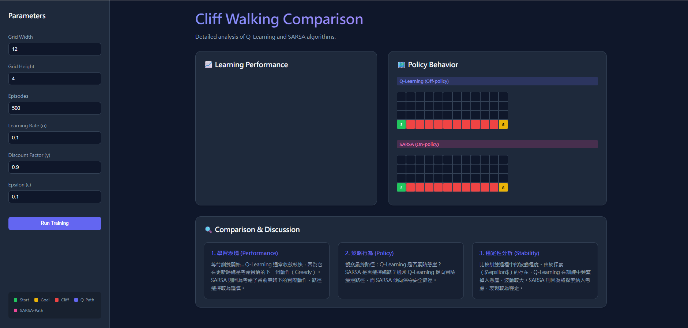
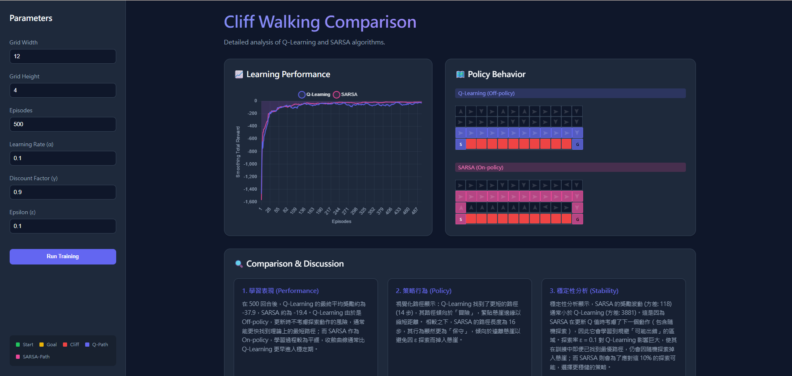

# 深度強化學習作業二：Cliff Walking 演算法對比 (Q-Learning vs SARSA)

> 🔗 **Live Demo**: [https://drl-hw2-3wv6.onrender.com](https://drl-hw2-3wv6.onrender.com)


本專案旨在透過經典的「懸崖行走」(Cliff Walking) 環境，深入探討並比較兩種基本的時序差分 (Temporal Difference, TD) 演算法：**Q-Learning** 與 **SARSA**。透過互動式 Web 介面，我們能即時觀測兩者在相同環境參數下的學習表現與決策差異。

## 🚀 專案特點
- **互動式側邊欄**: 提供仿 Streamlit 的參數調整介面，可即時修改地圖維度、學習率及探索率。
- **動態路徑動畫**: 代理人會以動畫形式展示最終學習到的路徑，直觀呈現決策過程。
- **策略箭頭視覺化**: 背景動態顯示每一格的 $Q(s, a)$ 最佳策略箭頭，對比冒險與保守策略的本質差異。
- **自動化報告**: 訓練結束後自動生成量化分析，比較收斂速度、穩定性與風險傾向。

---

## 📂 檔案結構
```text
DRL_hw2/
├── app.py              # Flask 後端伺服器 (Production Ready)
├── rl_engine.py        # 強化學習環境與 Agent 邏輯
├── render.yaml         # Render 佈署設定檔
├── requirements.txt    # 專案依賴套件
├── static/
│   ├── css/style.css   # 介面美化與箭頭動畫
│   └── js/main.js      # 前端邏輯與動態渲染
└── templates/
    └── index.html      # 主頁面模板
```

---

## 🛠️ 環境參數設置
在進行實驗前，我們設置了標準的參數以確保公平比較：



- **網格大小**: 4x12 (可自定義)
- **探索率 (ε)**: 0.1 (ε-greedy)
- **學習率 (α)**: 0.1
- **折扣因子 (γ)**: 0.9
- **訓練回合**: 500+ Episodes

---

## 📊 成果展示與分析
實驗結果顯示了 Off-policy 與 On-policy 兩者截然不同的行為模式：



### 1. 學習表現 (Learning Performance)
- **Q-Learning**: 收斂速度顯著較快。由於其更新時採用最優動作 (Greedy) 的預期，能迅速鎖定最短路徑。
- **SARSA**: 收斂曲線較為平滑，雖然初期進步較慢，但在訓練過程中能維持較高的累積獎勵。

### 2. 策略行為 (Policy Behavior)
- **箭頭視覺化**: 透過背景箭頭可以發現，Q-Learning 的箭頭在懸崖邊緣全數指向目標；而 SARSA 的箭頭在懸崖上方則呈現向上繞行的趨勢。
- **Q-Learning (冒險最短路徑)**: 最終學習到的路徑通常緊貼懸崖邊緣（例如倒數第二列）。它不考慮探索行為可能導致的掉落風險，追求理論最優路徑。
- **SARSA (保守安全路徑)**: 最終路徑通常會繞過懸崖。這是因為 SARSA 考慮了探索行為帶來的風險，學習到了在包含隨機動作的情況下最安全的策略。

### 3. 穩定性分析 (Stability)
- **Q-Learning**: 在訓練過程中波動較大。即便已經找到最優路徑，仍會因隨機探索頻繁掉入懸崖。
- **SARSA**: 表現極為穩定。它學習到了避開「危險區域」的行為，使得隨機探索也不易造成重大處罰。

---

## 📖 理論討論 (依據作業總結)
根據演算法原理與實驗觀測：

- **Q-Learning (Off-policy)**: 其更新基於「下一狀態的最佳可能行動」，即使該行動未實際執行。因此，它傾向學習到理論上的最優策略，但在訓練過程中可能較具風險。
- **SARSA (On-policy)**: 其更新基於「實際採取的行動」，因此會反映探索策略的影響。它傾向學習在實際探索策略下較安全、穩定的行為。

---

## 🏁 結論
1. **收斂速度**: Q-Learning > SARSA。
2. **穩定性**: SARSA > Q-Learning。
3. **情境選擇**:
   - 若環境模型已知且無風險損失，或是在離線訓練時追求極限效率，應選擇 **Q-Learning**。
   - 若代理人在現實世界或高風險環境中在線學習，且掉入懸崖（重大處罰）的代價極高，應選擇 **SARSA** 以確保訓練過程的安全性。

---
